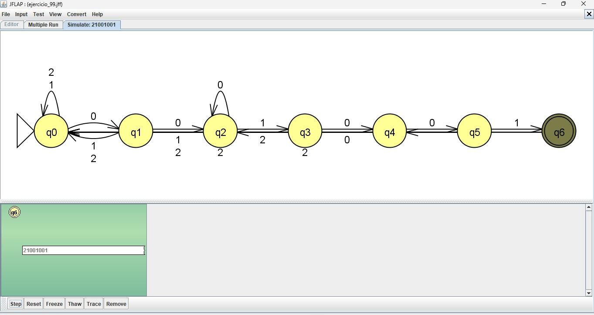
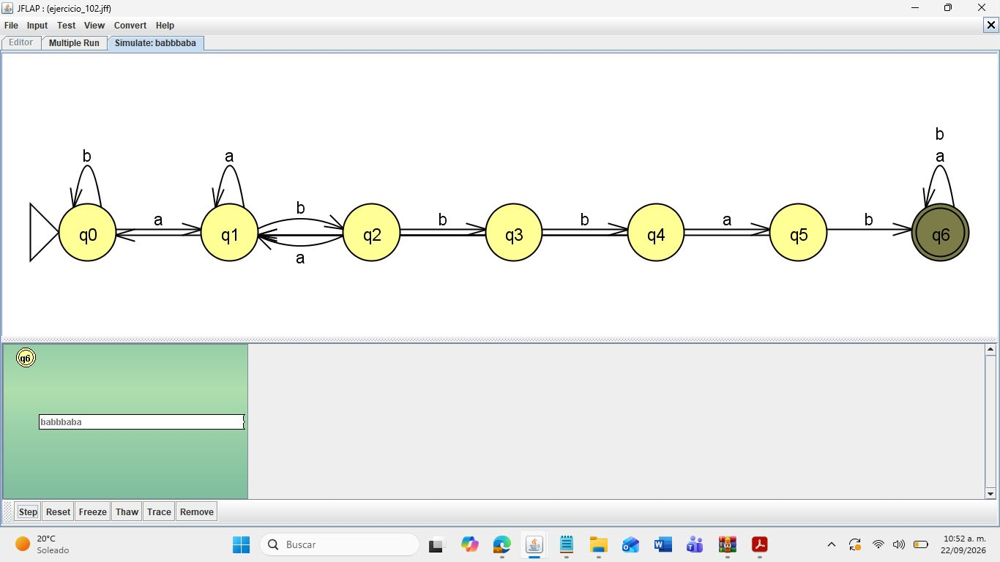
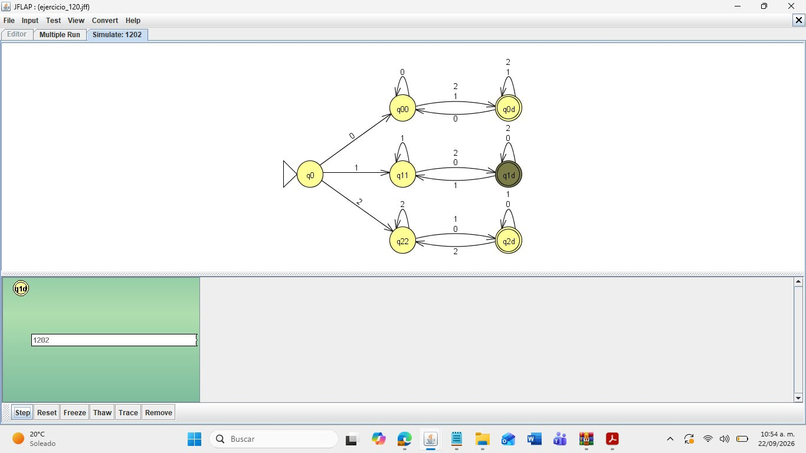
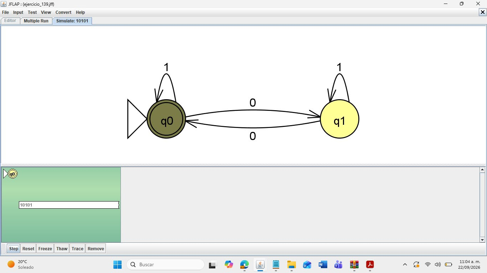
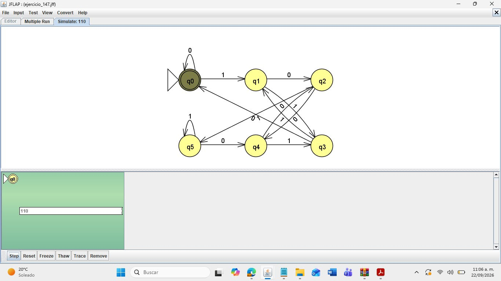

Ejercicio 4: Autómatas Finitos en JFLAP

Descripción y Justificación de Soluciones

Se diseñaron e implementaron autómatas finitos deterministas (AFD) utilizando la herramienta JFLAP para procesar cadenas de sus respectivos lenguajes.

1. Autómata Ejercicio 99
- **Propósito:** Reconoce cadenas sobre el alfabeto \(\{0, 1, 2\}\).
- **Estados:** \(Q = \{q_0, q_1, q_2, q_3, q_4, q_5, q_6\}\), con \(q_0\) como estado inicial y \(q_6\) como estado final de aceptación.
- **Evidencia:**
  

2. Autómata Ejercicio 102
- **Propósito:** Reconoce cadenas sobre el alfabeto \(\{a, b\}\).
- **Estados:** \(Q = \{q_0, q_1, q_2, q_3, q_4, q_5, q_6\}\), con \(q_0\) inicial y \(q_6\) final.
- **Evidencia:**
  

3. Autómata Ejercicio 120
- **Propósito:** Procesa cadenas sobre \(\{0, 1, 2\}\) con ramas paralelas hacia estados etiquetados con \(d\).
- **Estados:** \(Q = \{q_0, q_{00}, q_{11}, q_{22}, q_{0d}, q_{1d}, q_{2d}\}\), donde \(q_0\) es el inicial y \(q_{1d}\) es de aceptación.
- **Evidencia:**
  

4. Autómata Ejercicio 139
- **Propósito:** AFD sobre el alfabeto binario \(\{0, 1\}\).
- **Estados:** \(Q = \{q_0, q_1\}\), donde \(q_0\) es tanto estado inicial como final.
- **Evidencia:**
  

5. Autómata Ejercicio 147
- **Propósito:** Autómata con interconexiones cruzadas sobre el alfabeto binario \(\{0, 1\}\).
- **Estados:** \(Q = \{q_0, q_1, q_2, q_3, q_4, q_5\}\), con \(q_0\) como inicial y final.
- **Evidencia:**
  
